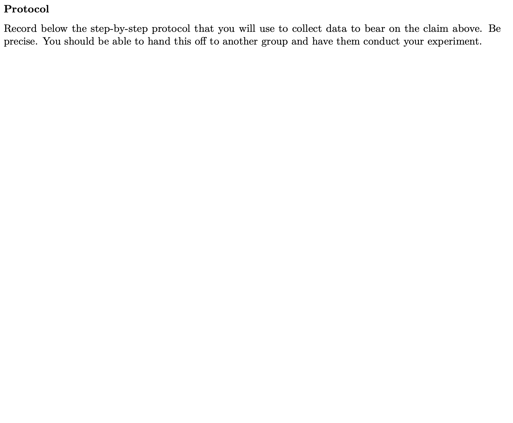

```{r setup, include=FALSE, warning=FALSE}
knitr::opts_chunk$set(message = FALSE,
                      warning = FALSE,
                      echo = FALSE,
                      fig.align = "center",
                      fig.retina = 3)

library(tidyverse)
library(xaringanthemer)
library(stat20data)
data(arbuthnot)
source("https://raw.githubusercontent.com/stat-20/stat-20-website/main/xaringan-theme.R")
ggplot2::theme_set(ggplot2::theme_gray(base_size = 18))
```

# Agenda

1. Collecting data: a question of taste
2. Debugging tips (if time)

???

# Suggested timeline
- [10 min] Slides and making teams
- [25 min] Working on the protocol
- [15 min] Debugging tips

# General Advice
- The students have seen *nothing* about experimental design yet in class. The idea is to have them use their own mental models to solve this problem, then later review and revise them. That's to say: coach them only to be precise in their protocol, not to be using best practices in experimental design. Errors made here are great learning opportunities later.
- The first phase of the lab can all be done with paper and pencil, so you can ask that students stow their laptops.
- This can be a bit of a jolt for students: from working with ggplot2 code to suddenly thinking about experiments without having seen them in class. Start by reviewing briefly the main arcs from last week and trying to tie it into the Boba Fete this week.
- Tips on Debugging R Code can be used to fill any time at the end after protocols are done.


---
class: middle, center

## Constructing Claims from Data

---

**John Arbuthnot's Question**: What proportion of total births are of boys?

**The Data**: Christening records from London churches.

**The Analysis**: In all years studied, the proportion of boys exceeded 50%.

```{r echo = FALSE, fig.height = 3}
arbuthnot <- arbuthnot %>%
  mutate(p_boys = boys / (boys + girls))
ggplot(arbuthnot, aes(x = year, y = p_boys)) +
  geom_line() +
  ylim(0, 1)
```

**Potential Claim**: At birth, humans are more likely to be genetically male than genetically female.

???
First layout the arc of the Arbuthnot lab from last week. The general theme is: how can we construct claims and answer questions using data?

This week students will work backwards: start with a claim that they think may be true, then decide how to collect data in a manner that will be most effective at determining whether or not the claim is true.

---
class: middle, center

### But first

Please get into groups of 3 (4 is ok too). Take turns introducing yourselves.

---
## Boba F&ecirc;te

**Your challenge**: Determine whether or not one of your group members can distinguish between two different types of boba tea.

--

### Each team will have

- 50 minutes (lab Thursday)
- 2 cups of boba, each one from a different shop in town
- small cups
- spoons
- straws
- saltine crackers
- plain soda water


---
## Group Members

```{r}
knitr::include_graphics("figs/members.png")
```

???
The main reason for the roles here is to dedicate just one person to handling the materials for covid safety. There will also be gloves and sanitizer.


---
## Claim

```{r}

```

???
Prompt them to think carefully about their wording here. How ambitious and general do they want to be?

---
## Protocol

```{r}

```

???
Here they must be very precise. We're spoken about reproducible science in class, so use that language to encourage careful work. They must be able to pass this protocol off to another group, and they should be able to carry out the intended experiment with no ambiguity.


---
## Data

```{r}
knitr::include_graphics("figs/data.png")
```

???
This is intended to be a blank table with n columns and at least 1 row. They may plan to record either variables or not enough to draw the conclusions they intend. As before, don't correct them. They may discover mid-experiment that they did this part wrong, and that's great.

---
## Graphics

```{r}

```

---
## Things to remember

- Be precise in your protocol.
- For Thursday's lab, meet outside Evans.
- Before leaving today, take a photo of both sides of the handout.

