```{r setup, include=FALSE, warning=FALSE}
knitr::opts_chunk$set(message = FALSE,
                      warning = FALSE,
                      fig.align = "center",
                      fig.retina = 3)

library(tidyverse)
library(xaringanthemer)
library(xaringanExtra)
library(stat20data)
data(arbuthnot)
source("https://raw.githubusercontent.com/stat-20/stat-20-website/main/stat20-theme.R")
xaringanExtra::use_panelset()
ggplot2::theme_set(ggplot2::theme_gray(base_size = 18))
set.seed(34)
```

```{r echo = FALSE}
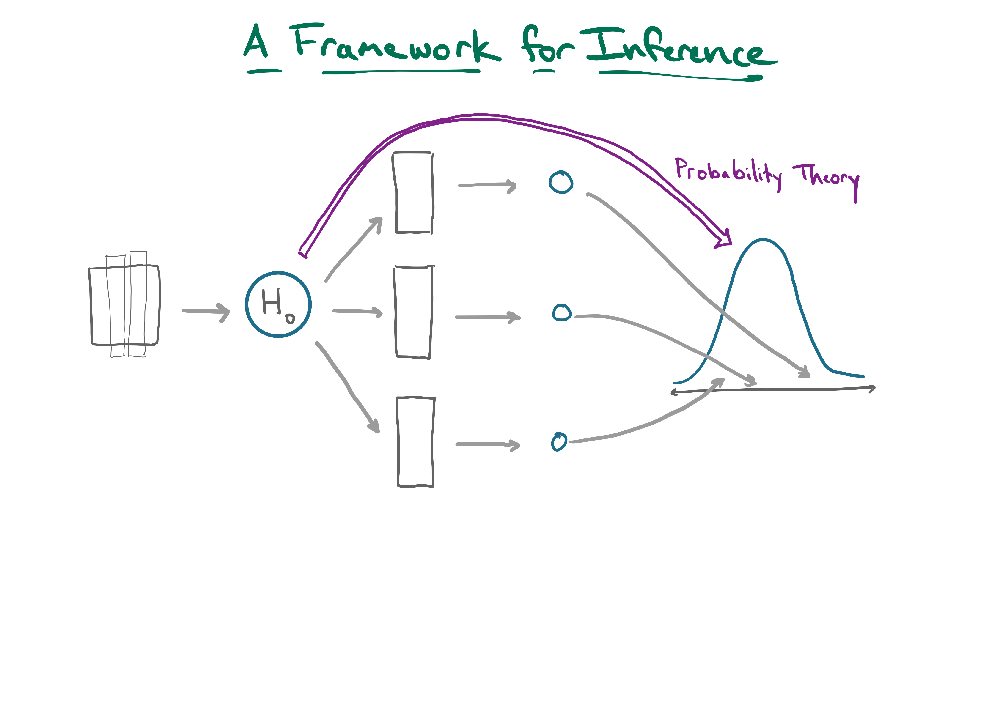
```

???

# Goal
1. Develop familiarity with the 5 core functions in `infer`: specify, hypothesize, generate, calculate, and visualize.

# Time
- [10 min] Slides: specify through generate
- [3 min] On Your Own: facetted ggplot
- [10 min] Slides: calculate through get_p_value
- [20 min] Students work through `yawn` and `millenials` on their own.
- [10 min] Discuss the millenials problem as a group, at the board and the console.

# Tips
- Have up the infer documentation page and refer to it throughout.
- Feel free to use the board instead of slides for introducing each function.
- Intentionally make mistakes as you code and ask the students to help troubleshooting.
- Encourage students to "break the pipe" and think about whats going into each function and what's coming out. Particularly important when going through `generate()` and `calculate()`.
- Reference back to skills from `dplyr` and `ggplot2` whereever they come up. e.g. `calculate()` is effectively group-by replicate and summarize with the statistic. `visualize()` wraps `geom_histogram()`.
- For the millenials example, the changes: specify requires a change of variables and an inclusion of the "success" argument, hypothesis is now a point, with p = .5, and the statistic is now "prop".

---
## Setup: R packages

Your computing toolkit so far:

--

```{r}
library(tidyverse)
# library(ggplot2)  # Data Visualization
# library(dplyr)    # Data Wrangling
library(stat20data) # Data Sets
library(infer)      # Classical Inference
```

If you have questions about `infer`, please check:

`infer.netlify.app`

---
## Setup: Example

**Question**: Are promotion decisions independent of the gender on the name of the application?

--

.pull-left[
```{r promote-data, eval = FALSE}
data(promote)
promote %>%
  ggplot(aes(x = gender,
             fill = decision)) +
  geom_bar(position = "fill")
```
]

--

.pull-right[
```{r fig.height=5, echo = FALSE}
data(promote)
p_promote <- promote %>%
  ggplot(aes(x = gender,
             fill = decision)) +
  geom_bar(position = "fill")
p_promote
```

]


---

```{r echo = FALSE}
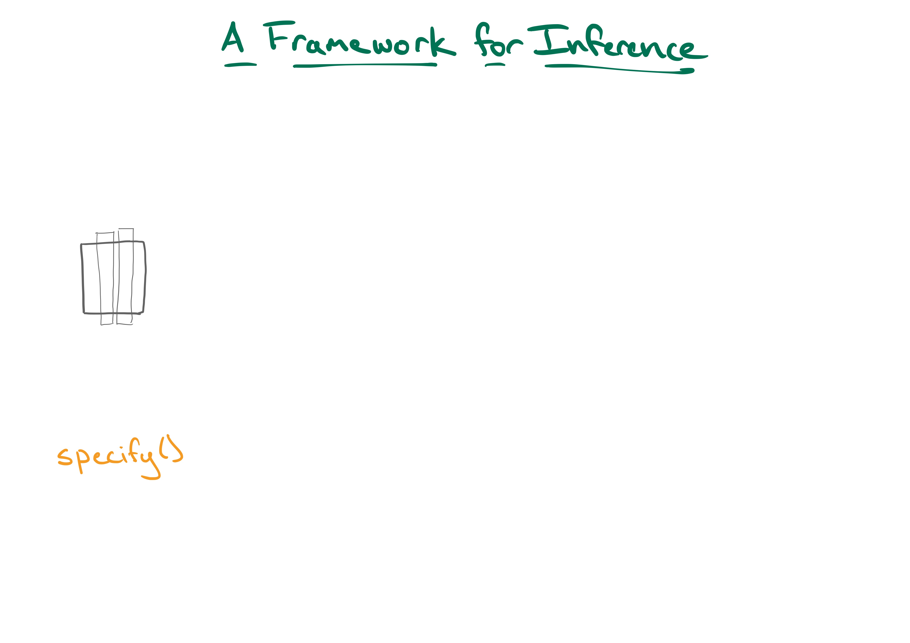
```

---

```{r echo = FALSE}
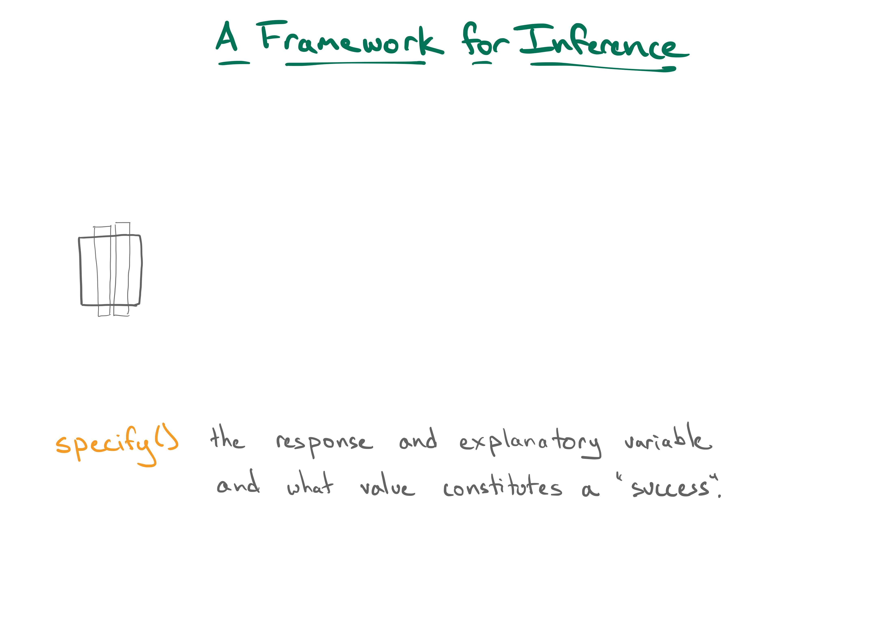
```


---
## `specify()`

Specifies the response and explanatory variables and what value constitutes a "success" (where applicable).

--

**Question**: Are promotion decisions independent of the gender on the name of the application?

--

.pull-left[
```{r}
data(promote)
promote
```
]

--

.pull-right[
- Response = `decision`
- Explanatory = `gender`
]

---

## `specify()`, cont.

```{r specify1, eval = FALSE}
promote %>%
  specify(response = decision,
          explanatory = gender)
```

--

```{r ref.label = "specify1", echo = FALSE, error = TRUE}
```

--

```{r specify2, eval = FALSE}
promote %>%
  specify(response = decision,
          explanatory = gender,
          success = "promote")
```

--

```{r ref.label = "specify2", echo = FALSE, error = TRUE}
```

---
## `specify()`, cont.

Get in the habit of using R's "formula notation": `y ~ x` reads: 
"y is explained by x".

--

.pull-left[
```{r}
promote %>%
  specify(response = decision,
          explanatory = gender,
          success = "promote")
```
]

--

.pull-right[
```{r}
promote %>%
  specify(decision ~ gender,
          success = "promote")
```
]

---

```{r echo = FALSE}

```

---

```{r echo = FALSE}
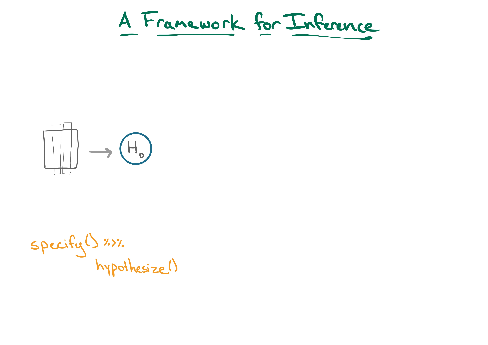
```

---

```{r echo = FALSE}
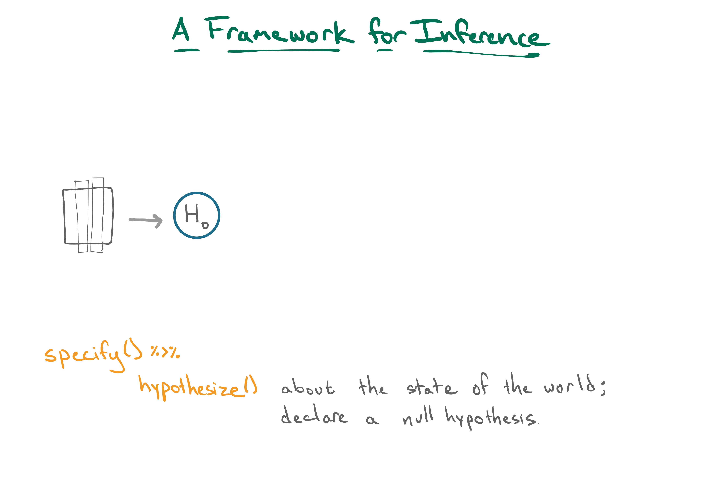
```


---
## `hypothesize()`

Declares a null hypothesis. Either `"independence"` or `"point"`.

--

**Question**: Are promotion decisions independent of the gender on the name of the application?

--

```{r hypo, eval = FALSE}
promote %>%
  specify(decision ~ gender, success = "promote") %>%
  hypothesize(null = "independence") #<<
```

--

```{r ref.label="hypo", echo = FALSE}
```

---

```{r echo = FALSE}

```

---

```{r echo = FALSE}
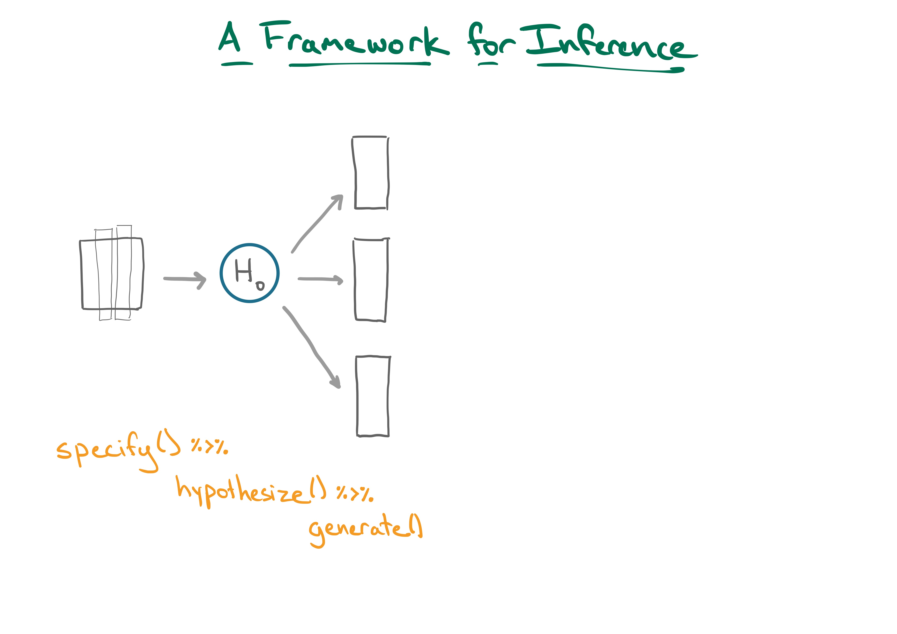
```

---

```{r echo = FALSE}
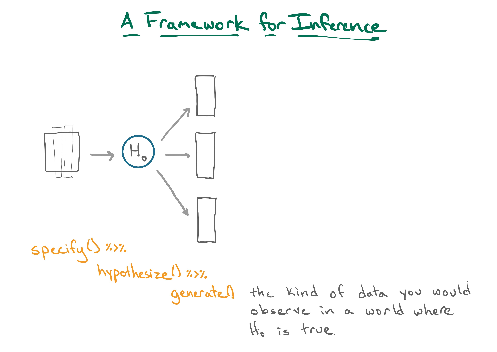
```

---
## `generate()`

Generates `reps` replicates of the kind of data you would observe if the null hypothesis was true either via `permute` or `draw`.

--

```{r gen, eval = FALSE}
promote %>%
  specify(decision ~ gender, success = "promote") %>%
  hypothesize(null = "independence") %>%
  generate(reps = 1, type = "permute") #<<
```

--

```{r ref.label="gen", echo = FALSE}
```

???

NB: keep an eye on data frame dimensions before and after `generate()`.

---
## `generate()`, cont.

What does the data look like when the null is true? One look:

---

.panelset[

.panel[.panel-name[Observed Data]
```{r ref.label = "promp1", echo = FALSE, fig.height=4}
```

```{r promp1, eval = FALSE}
promote %>%
  ggplot(aes(x = gender,
             fill = decision)) +
  geom_bar(position = "fill")
```
]

.panel[.panel-name[Permuted Data]
```{r ref.label = "promp2", echo = FALSE, fig.height=4}
```

```{r promp2, eval = FALSE}
promote %>%
  specify(decision ~ gender, success = "promote") %>% #<<
  hypothesize(null = "independence") %>% #<<
  generate(reps = 1, type = "permute") %>% #<<
  ggplot(aes(x = gender,
             fill = decision)) +
  geom_bar(position = "fill")
```
]
]

---
class: inverse

## Your turn

```{r eval = FALSE}
promote %>%
  specify(decision ~ gender, success = "promote") %>%
  hypothesize(null = "independence") %>%
  generate(reps = 1, type = "permute") %>%
  ggplot(aes(x = gender,
             fill = decision)) +
  geom_bar(position = "fill")
```

.task[
Modify the code above to create a visualization with _9 subplots_, each showing different examples of the sort of data you would see in a world where this null hypothesis is true.
]

---

```{r echo = FALSE}

```

---

```{r echo = FALSE}
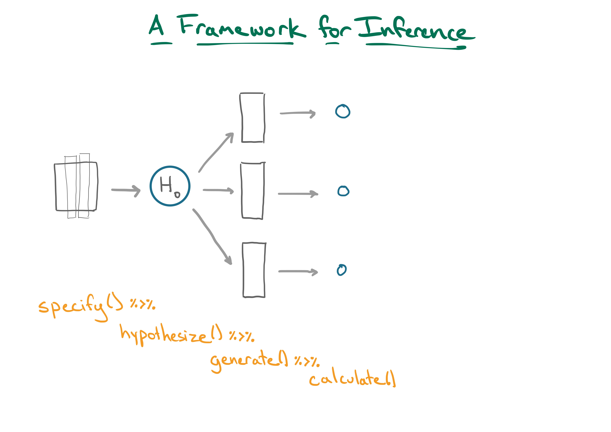
```

---

```{r echo = FALSE}
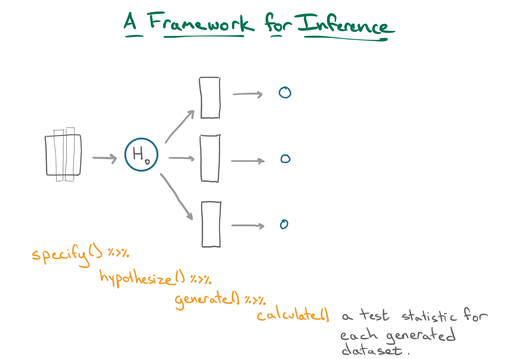
```

---
## `calculate()`

Calculates a test statistic for each generated data set.

```{r calc1, eval = FALSE}
promote %>%
  specify(decision ~ gender, success = "promote") %>%
  hypothesize(null = "independence") %>%
  generate(reps = 9, type = "permute") %>%
  calculate(stat = "diff in props", #<<
            order = c("male", "female")) #<<
```

--

```{r ref.label = "calc1", echo = FALSE}
```

???
NB: keep an eye on data frame dimensions before and after `calculate()`.

---

```{r echo = FALSE}

```

---

```{r echo = FALSE}
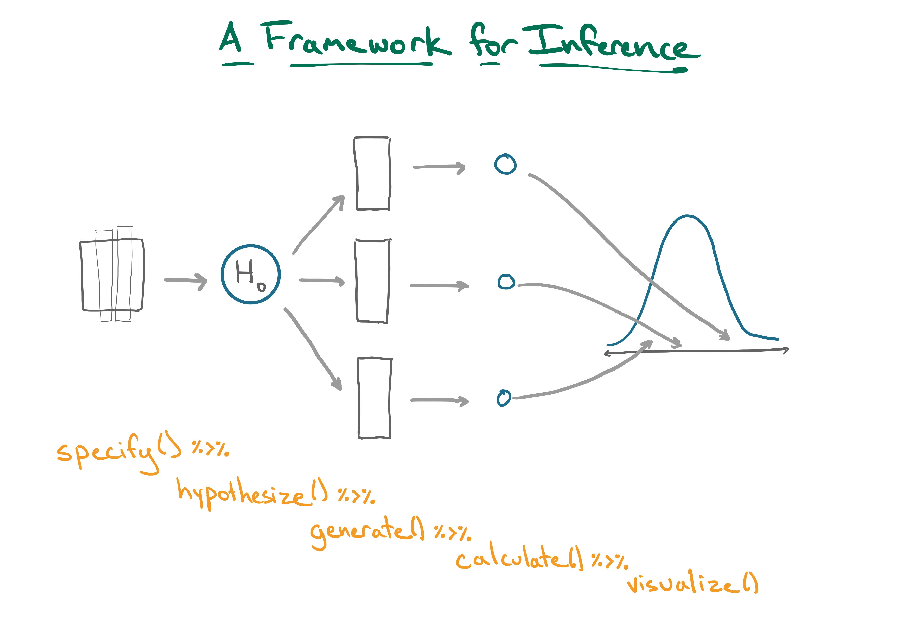
```

---

```{r echo = FALSE}
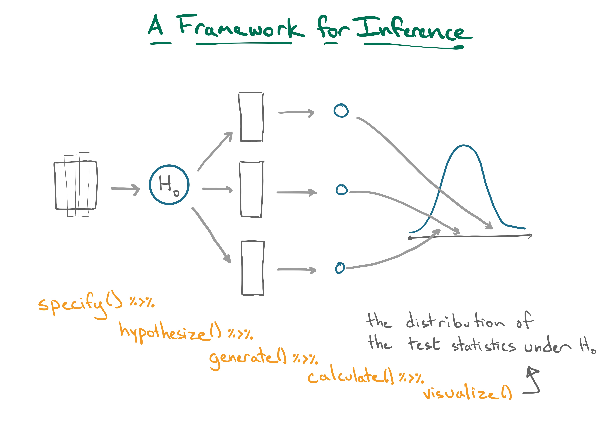
```

---
## `visualize()`

Visualizes the distribution of the test statistics under the null hypothesis.

--

```{r viz, eval = FALSE}
promote %>%
  specify(decision ~ gender, success = "promote") %>%
  hypothesize(null = "independence") %>%
  generate(reps = 9, type = "permute") %>%
  calculate(stat = "diff in props",
            order = c("male", "female")) %>%
  visualize() #<<
```

--

```{r ref.label = "viz", echo = FALSE, fig.height = 3}
```

---
class: center, middle, inverse

## What will happen if we increase reps to 500?

---

```{r viz2, eval = FALSE}
promote %>%
  specify(decision ~ gender, success = "promote") %>%
  hypothesize(null = "independence") %>%
  generate(reps = 500, type = "permute") %>% #<<
  calculate(stat = "diff in props",
            order = c("male", "female")) %>%
  visualize()
```

--

```{r ref.label = "viz2", echo = FALSE, fig.height = 3}
```

--

> As a rule of thumb, 500 replicates is sufficient to get a smooth null distribution and a precise p-value.

---
## Visualizing the obs. stat

You can compute your _observed_ statistic by removing the parts of the pipeline that don't apply.

--

```{r obs, eval = FALSE}
obs_stat <- promote %>%
  specify(decision ~ gender, success = "promote") %>%
  # hypothesize(null = "independence") %>%
  # generate(reps = 500, type = "permute") %>%
  calculate(stat = "diff in props",
            order = c("male", "female"))
obs_stat
```

--

```{r ref.label = "obs", echo = FALSE}
```

---
## Visualizing the obs. stat, cont.

Let's save the null distribution of test statistics.

--

```{r null, eval = FALSE}
null <- promote %>%
  specify(decision ~ gender, success = "promote") %>%
  hypothesize(null = "independence") %>%
  generate(reps = 500, type = "permute") %>%
  calculate(stat = "diff in props",
            order = c("male", "female"))
null
```

--

```{r ref.label = "null", echo = FALSE}
```

---
## Visualizing the obs. stat, cont.

Let's visualize the `obs_stat` in the `null` by adding a layer to the ggplot.

--

```{r viz3, eval = FALSE}
null %>%
  visualize() +
  shade_p_value(obs_stat, direction = "both")
```

--

```{r ref.label = "viz3", echo = FALSE, fig.height=4}
```

---
## Getting a p-value

You can return the p-value using `get_p_value()`.

```{r pval, eval = FALSE}
null %>%
  get_p_value(obs_stat, direction = "both")
```

--

```{r ref.label = "pval", echo = FALSE}

```


